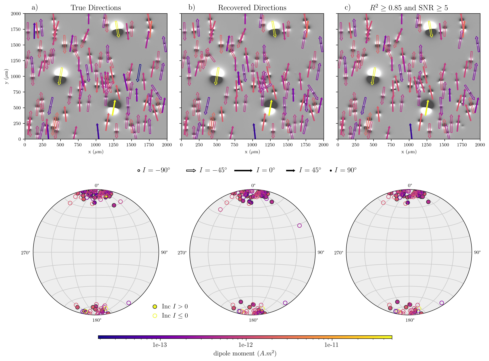

# Full vector inversion of magnetic microscopy images using Euler deconvolution as a priori information

[Gelson F. Souza Junior](https://orcid.org/0000-0002-5695-4239),
[Leonardo Uieda](https://orcid.org/0000-0001-6123-9515),
[Ricardo I. F. Trindade](https://orcid.org/0000-0001-9848-9550),
[Janine Carmo](https://orcid.org/0000-0003-3683-3648),
Roger Fu

This repository contains the data and source code used to produce the results
presented in:

> Souza Junior, G.F., Uieda, L., Trindade, R.I.F., Carmo, J., and Fu, R.
> (2023). Full vector inversion of magnetic microscopy images using Euler
> deconvolution as a priori information. EarthArXiv.
> https://doi.org/10.31223/x5qd5z

|  | Info |
|-:|:-----|
| Version of record | TBD |
| Open-access version on EarthArXiv | https://doi.org/10.31223/X5QD5Z |
| Archive of this repository | https://doi.org/10.6084/m9.figshare.22672978 |
| Reproducing our results | [`REPRODUCING.md`](REPRODUCING.md) |

## About

This paper presents a new method to automatically identify the signal from
individual magnetic particles in magnetic microscopy images and linearly invert
the data in 2 steps to determine the position and dipole moment of each
particle.
The idea for this work came from combining the group's expertise in applied
geophysics and paleomagnetism.
This is the first contribution from Gelson F. Souza Junior's PhD project.

The code that implements the method here is a proof-of-concept. A more
user-friendly version will be implemented in the open-source library
[Magali](https://github.com/compgeolab/magali).

> Synthetic data test showing that our method is able to automatically identify and 
> recover the dipole moments of a large number of magnetic particles.

## Abstract

Very small magnetic particles in rocks and other materials can store
information about what the Earth’s magnetic field was like in the past.
But not all particles are good recorders of this magnetic information, and some
may have recorded different overlapping directions and strengths.
So it is important to measure each particle separately in order to identify and
separate the good recorders from the bad ones.
A device called a "quantum diamond microscope" is able to measure the
magnetic field near the surface of a rock sample at microscopic scale.
We propose a new method for processing data from this microscope that is able
to find out the individual magnetizations of large amounts of small magnetic
particles automatically.
We created a computer program to execute the method, which calculates the 3D
position and magnetization of each particle using the simple model of a
magnetic dipole.
We tested the method on simulated data, using fake magnetic particles for which
we know the correct magnetization and position, and real data, both of which
showed good results in most cases.
The method we created has the potential to enable the widespread study of the
magnetism of natural materials with more detail than before.

## License

All Python source code (including `.py` and `.ipynb` files) is made available
under the MIT license. You can freely use and modify the code, without
warranty, so long as you provide attribution to the authors. See
`LICENSE-MIT.txt` for the full license text.

The manuscript text (including all LaTeX files), figures, and data/models
produced as part of this research are available under the [Creative Commons
Attribution 4.0 License (CC-BY)][cc-by]. See `LICENSE-CC-BY.txt` for the full
license text.

[cc-by]: https://creativecommons.org/licenses/by/4.0/

## Funding

This research was supported by grant 162704/2021-6 from the Conselho Nacional
de Desenvolvimento Científico e Tecnológico (CNPq), grant 2021/08379-5 from the
Fundação de Amparo à Pesquisa do Estado de São Paulo (FAPESP), and grant
IES\R3\213141 from the Royal Society.
The opinions, hypotheses, and conclusions or recommendations expressed in this
material are the responsibility of the authors and do not necessarily reflect
the views of FAPESP.
